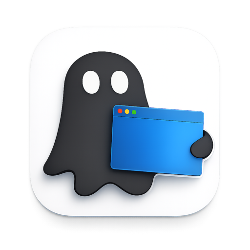

# GhostUI

<p align="center">
  
</p>

GhostUI is a macOS GUI automation system with two runtime pieces:

- A Swift app in `macOS/GhostUI/` that captures accessibility data and handles local UI/input surfaces.
- A Bun/TypeScript daemon in `ghost/src/` that maintains the live CRDT document and serves the display UI.

The outer workspace keeps shared docs in `../Documents/`.

## Build

```bash
make debug
make release
```

The app bundle is written to `.build/GhostUI.app`.

## Run

Launch the app bundle first:

```bash
open .build/GhostUI.app
```

Run the daemon separately when you want the browser display:

```bash
cd ghost
bun run src/daemon.ts
```

Open the display UI at `http://localhost:7861/display/0`.

## Repo Layout

- `macOS/GhostUI/` - Swift app, overlays, services, and resources.
- `ghost/src/` - daemon, CRDT, CLI, app adapters, and display UI source.
- `../Documents/Developer/Reference/Context-Menus.md` - context menu behavior notes.
- `../Documents/Data/A11y/` - accessibility capture corpus and schemas.
- `../Documents/Developer/Reference/macOS-Icons.md` - icon workflow notes.

## Notes

- The canonical icon source is `macOS/GhostUI/Resources/Icon/GhostUIIcon-final.png`.
